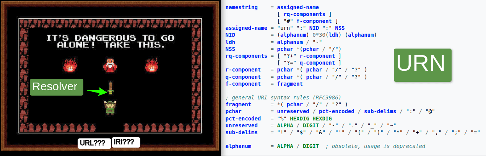

# URN Resolver open source server and `/.well-known/urn/` conventions
**This repository contains open source software to host your own a multi-propose [URN](https://en.wikipedia.org/wiki/Uniform_Resource_Name) Resolver and a working-draft open specification for `/.well-known/urn/`. Feedback in something so _overly specific_ is still welcomed!**



<!-- The idea of some resolver is not new ([EticaAI/HXL-Data-Science-file-formats#13](https://github.com/EticaAI/HXL-Data-Science-file-formats/issues/13)). -->

While it is possible to host content on cheap, static hosting (such as GitHub pages), resolvers require dynamic processing (and decent uptime).
The current implementation of opting for server-based comes from w3id (<https://github.com/perma-id/w3id.org>), which focuses on PURLs (not URNs), but PHP is used to allow more flexibility on configuration files over direct .htaccess rules.

----

**Table of contents**


<!-- TOC depthfrom:2 -->

- [The URN Resolver server](#the-urn-resolver-server)
    - [How to run local node](#how-to-run-local-node)
        - [Your first curl + jq commands](#your-first-curl--jq-commands)
    - [How to run production servers](#how-to-run-production-servers)
        - [Your first production single node recommended](#your-first-production-single-node-recommended)
        - [Your first high-availability cluster deployment](#your-first-high-availability-cluster-deployment)
- [The URN Resolver conventions/specifications](#the-urn-resolver-conventionsspecifications)
    - [/.well-known/urn/ convention](#well-knownurn-convention)
    - [urn.example.org: subdomain convention](#urnexampleorg-subdomain-convention)
- [Test cases](#test-cases)
    - [URN:DOI](#urndoi)
    - [URN:GEO](#urngeo)
    - [URN:IETF](#urnietf)
    - [URN:ISSN](#urnissn)
    - [URN:LEX:BR](#urnlexbr)
- [License](#license)

<!-- /TOC -->

----

## The URN Resolver server

**Trivia**: An production server is available at <https://urn.etica.ai>.
It's behind CloudFlare free plan
(can have "cache everything enabled"; can survive massive number of requests)
and is currently hosted on Dreamhost (shared hosting; single node).
The handcrafted rules at [resolvers](resolvers/) are converted to JSON and rsync'ed to the server.

### How to run local node

The current implementation uses PHP. Requires PHP >= 8.1
(no special dependencies, just rsync the files).

```bash
# Get a copy
git clone https://github.com/EticaAI/urn-resolver.git
cd urn-resolver/app/public

# Run PHP build-in server
php -S localhost:8000 router.php

# Visit home page: http://localhost:8000/
```

#### Your first curl + jq commands

> - curl: <https://curl.se/>
> - jq: <https://stedolan.github.io/jq/>

```bash
## Home page (show content); curl parameters used:
#   (-L) --location : follow links
#   (-s) --silent   : do not show transfer
# (next 2 commands are equivalent)
curl --location --silent 'http://localhost:8000/'
curl -Ls 'http://localhost:8000/'

## IETF URN: curl parameters used to show only headers (great to see redirects)
#   (-I) --head     : Show document info only
# (next 3 commands are equivalent)
curl --location --silent --head 'http://localhost:8000/urn:ietf:rfc:2141'
curl -LsI 'http://localhost:8000/urn:ietf:rfc:2141'
curl -Ls 'http://localhost:8000/urn:ietf:rfc:2141' --head

## urn:w3id:un/fao (this example have several redirects; 6 as 2022-09-27)
curl -Ls 'http://localhost:8000/urn:w3id:un/fao' --head

## home page, but with jq
curl -Ls http://localhost:8000/ | jq

## urn:resolver:ping; This one migth not return json
curl -Ls 'http://localhost:8000/urn:resolver:ping'

#### Other not so documented examples __________________________________________
## GitHub
# index
curl -Ls 'http://localhost:8000/urn:git:github:' | jq
# repositories for org=EticaAI
curl -Ls 'http://localhost:8000/urn:git:github:orgs/EticaAI/repos' | jq
## Gitee
# (example query) q=username
curl -Ls 'urn:git:gitee:search/users?q=username' | jq

```

### How to run production server(s)

#### Your first production single node (recommended)

Use the same strategy for the high-availability cluster below, but with a single node.

This strategy is simpler to keep online in particular if the number of requests is not able to be worth the trouble to keep load balancers.

#### Your first high-availability cluster deployment

On this example, `server-a.urn.example.org`, `server-b.urn.example.org` and `server-b.urn.example.org` are assumed to be direct access to any type of web hosting able to run PHP (inclusive cheap shared hosting) which also respond for `urn.example.org`.
This example allows [High-availability cluster](https://en.wikipedia.org/wiki/High-availability_cluster) with [https://en.wikipedia.org/wiki/Round-robin_DNS](https://en.wikipedia.org/wiki/Round-robin_DNS) as load balancing strategy: just make sure `urn.example.org` points to IPs of server-a, server-b and server-c.

```bash
# Get a recent copy from some place.
git clone https://github.com/EticaAI/urn-resolver.git

# Configure your node
cp urnresolver.dist.conf.json urnresolver.conf.json
vim urnresolver.conf.json

# Replace DRY_RUN="1" with DRY_RUN="0" (disable rsync --dry-run) and remote
DRY_RUN="1" RSYNC_REMOTE="user@server-a.urn.example.org/home/user/public_html" ./scripts/sync-node-a.sh
DRY_RUN="1" RSYNC_REMOTE="user@server-b.urn.example.org/home/user/public_html" ./scripts/sync-node-a.sh
DRY_RUN="1" RSYNC_REMOTE="user@server-c.urn.example.org/home/user/public_html" ./scripts/sync-node-a.sh

```

> **Warning**: if you run a cluster behind free solution which also does cache but hide the true IPs from end user (like free Cloudflare; which we do recommend) you will need to check manually if servers are online and [STONITH - ("Shoot The Offending Node In The Head")](https://en.wikipedia.org/wiki/STONITH) and remove nodes not working.

> **Note**
> While most reverse proxies (such as Cloudflare even without paid load balance plans) will try next node if the entire source server is offline (e.g. rebooting) at least user browsers such as Chrome will also automatically check the next IP if they receive an 5xx server error (even if the server is online, but your app is failing).
This _poor's man load balancing_ works, but is a last resort.
It cannot cope if 1/3 (1 out of 3 nodes) or 1/2 (50% of your nodes) are online and (worst) reply 200 OK, but content is "welcome to nginx" / "welcome to apache".

## The URN Resolver conventions/specifications

> The key words "MUST", "MUST NOT", "REQUIRED", "SHALL", "SHALL
> NOT", "SHOULD", "SHOULD NOT", "RECOMMENDED",  "MAY", and
> "OPTIONAL" in this document are to be interpreted as described in
> [RFC 2119](https://www.rfc-editor.org/rfc/rfc2119).

### /.well-known/urn/ convention

> **Warning**: the entire `/.well-known/urn/` is a draft.
> The intent is to describe the strategy used on the software implementation in a way that is not vendor dependent.
> **Feel free to check the actual content of the folder [public/.well-known/urn](public/.well-known/urn)**. The YAML files on [resolvers/](resolvers/) are not part of this convention (are _implementation detail_).

The files published on `/.well-known/urn/` are inspired by the [RFC 8615 - Well-Known Uniform Resource Identifiers (URIs)](https://www.rfc-editor.org/rfc/rfc8615).
Do exist a list of [IANA Well-Known URIs](https://www.iana.org/assignments/well-known-uris/well-known-uris.xhtml),
however at the moment (2022-09-25), no submission as made (even as provisional) to IANA.
In the meantime, the quick overview of the implementation, which is open for feedback,
to explain the files is:

- `/.well-known/urn/urn.txt` (<http://urn.example.org/.well-known/urn/urn.txt>)
  - It's an index file. This TXT file lists all files on the server under the `/.well-known/urn/`.
  - The file names **MUST** be a regex rule to give a hint of what rules the entire file is about without need to read file by file. In this document this is referred as `<FILENAME_RULE_GROUP>`
  - The filename stops at `.urnr` part of the file.
  - The container of the rules **MUST** start after the `.urnr`.
  - For maximum interoperability **MUST** have at least JSON format. However, this format **MUST NOT** be a [JSON Schema](https://json-schema.org/) and do not use same extension as JSON documents
    - Example: `.urnr.json` (can reference JSON Schema, but not a JSON schema itself)
  - Files under `/.well-known/urn/` **MAY** may have more than one encoding. However, files with same `<FILENAME_RULE_GROUP>` **MUST** be considered to be about the same resource even if some parser understands more than one format.
  - Example:
    - `urn:doi:(.*).urnr.json` (example of REQUIRED resource)
    - `urn:doi:(.*).urnr.yml` (example of alternative encoding in YAML)
    - `urn:doi:(.*).urnr.txt` (example of text file)
- `/.well-known/urn/<FILENAME_RULE_GROUP>.urnr.<FILE_CONTAINER_FORMAT>` (example: <http://urn.example.org/.well-known/urn/urn:doi:(.*).urnr.json>)
  - Note: as 2022-09-25, the content of the file rules still need more real world testing.

### `urn.example.org`: subdomain convention

> **Note**:
> - Know real world examples (not related to this convention) know to follow this logic of using `urn.` subdomain and no subfolder:
>   - <https://urn.fi/>
>   - <https://urn.issn.org/>
> - Counter examples (e.g, able to resolve own URNs on main domain):
>   - <https://www.doi.org/>
> - [PURL](https://en.wikipedia.org/wiki/Persistent_uniform_resource_locator) also serve as inspiration of use of sudomains.
>   The `purl.` is used in `purl.oclc.org`, `purl.archive.org` and `purl.obolibrary.org`.


It's **RECOMMENDED** for new implementations to define a URN resolver with its own dedicated subdomain `urn.` both for signal intent and for performance reasons
(e.g. in case necessary move the resolver to different server infrastructure than content on some main site).

Example:

- `https://www.example.com` (or `https://example.com`):
  - `https://urn.example.com`
- `https://my-university.example.org`:
  - `https://urn.my-university.example.org`
- `https://my-department.my-university.example.org`:
  - `https://urn.my-department.my-university.example.org`

The URN Resolvers **MUST** be resolvable at the top level of the chosen domain.
This means it is forbidden to use subfolders
(even for testing environments)
as an entrypoint to avoid confusion with users about what is the URN content and what is the resolver.
The URN resolvers also **MUST NOT** require a query string or fragment string.

Example:

- User want know how to resolve this URN: `urn:example:123`
  - Conformant: `https://urn.my-university.example.org/urn:example:123`
  - NOT conformant (subfolder):
    - `https://urn.my-university.example.org/folder/urn:example:123`
  - NOT Conformant (query string):
    - `https://urn.my-university.example.org/?urn=urn:example:123`
  - NOT Conformant (fragment):
    - `https://urn.my-university.example.org/#urn:example:123`

There is no restriction for redirects after the initial request.
This means URN Resolvers, as long as public adversised entrypoint is conformant,
**MAY** make additional rewrites before redirect to external servers.
One common reason for this behavior are URNs which are more complex to process than shareable URN Resolver Rules to other public resolvers.
See Peer-to-peer section.

<!--

ssh://urn.etica.ai/home/urneticaai/urn.etica.ai/
-->

<!-- 
  ### Peer-to-peer URN Resolver Server conventions

An URN Resolver Server able to understand rules of its own `/.well-known/urn/` will also understand if rules are copied from another server to its own public folder.

#### URN Resolver Rules sharing

An operator from an URN Resolver Server **MAY** opt for use as reference to the rules from another server in an automated way.


the operators of URN Resolver servers may

Use case:

- `urn.op-geo.example.org` and `urn.op-generic.example.org` can resolve near same URNs
- User wants resolve the URN `urn:example:adm:ago?f=gpkg` and asks `urn.op-generic.example.org`
- (...) 
-->

<!-- 
  ## (...)

Check [resolvers](resolvers/) folder.

[](https://xkcd.com/208/)

-->


## Test cases

### URN:DOI
- https://urn.etica.ai/urn:doi:10.1000/182

### URN:GEO
- https://urn.etica.ai/urn:geo:-19.9026,-44.0340;u=100000

### URN:IETF
- https://urn.etica.ai/urn:ietf:rfc:2141
- https://urn.etica.ai/urn:ietf:bcp:47

### URN:ISSN
- https://urn.etica.ai/urn:issn:1476-4687

### URN:LEX:BR
- https://urn.etica.ai/urn:lex:br:federal:lei:2008-06-19;11705
- https://urn.etica.ai/urn:resolver:about:urn:lex:br:federal:lei:2008-06-19;11705


<!--
## @TODO
### Load testing
- https://gist.github.com/denji/8333630
- Uptime robot bagdge https://github.com/badges/shields/issues/824

### Schemas
- https://www.schemastore.org/json/
- https://json-schema.org/learn/examples/geographical-location.schema.json
- https://jsonapi.org/
  - Online apps (needs testing)
    - http://codeme.lt/json-api-document-viewer/
- https://jsonapi.org/schema

### Validators
- https://validator.schema.org/
- https://json-ld.org/playground/
  - https://json-ld.org/spec/latest/json-ld/#nested-properties
- https://www.jsonschemavalidator.net/

### Logos
- https://github.com/json-api/json-api/issues/1655
- https://json-ld.org/images/
- https://www.w3.org/RDF/icons/
- https://www.hydra-cg.com/spec/latest/core/ (maybe)
-->

## License

[](UNLICENSE)

To the extent possible under law, [Emerson Rocha](https://github.com/fititnt)
has waived all copyright and related or neighboring rights to this work to
[Public Domain](UNLICENSE).

Optionally, you can choose to use the [MIT License](https://opensource.org/licenses/MIT)
instead of Public Domain unlicense.
